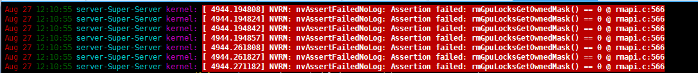

# A critical bug crashes driver and renders the GPU unusable: by cuSolverDn handle and cuMalloc

## Description

Hi，developers. I have encountered a critical parallel bug in cuSOLVER: a handle-related memory allocation triggers a fatal driver crash that affects every GPU process and renders the device unusable; the only recovery is a full server reboot. The issue reproduces reliably, and I have attached a screen recording(a 3minutes video) for your reference.

## Replicate

Triggering this bug needs two codes. The first:

```c
#include <stdio.h>
#include <stdlib.h>
#include <cuda_runtime.h>

// define the kernel function
__global__ void mykernel(int *data) {
    int idx = threadIdx.x + blockIdx.x * blockDim.x;
    data[idx] *= 2;
}

int main() {
    // invoke the given CUDA API according to given order
    int numElements = 100*1024*1024;
    int size = numElements * sizeof(int);
    int *h_data = (int *)malloc(size);
    for (int i = 0; i < numElements; i++) {
        h_data[i] = i;
    }
    int *d_data;
    cudaMalloc((void**)&d_data, size);
    cudaMemcpy(d_data, h_data, size, cudaMemcpyHostToDevice);

    // Launch the kernel
    int blockSize = 16;
    int numBlocks = (numElements + blockSize - 1) / blockSize;
    mykernel<<<numBlocks, blockSize>>>(d_data);
    cudaMemcpy(h_data, d_data, size, cudaMemcpyDeviceToHost);
    cudaDeviceSynchronize();
    for (int i = 0; i < numElements; i++) {
        printf("%d: %d\n", i, h_data[i]);
    }
    free(h_data);
    cudaFree(d_data);
    return EXIT_SUCCESS;
}
```

the second:

```c
#include <fcntl.h>
#include <cmath>
#include <stdio.h>
#include <unistd.h>
#include <string.h>

#include <stdio.h>
#include <stdlib.h>
#include <cuda_runtime.h>
#include <cusolverDn.h>

// CUDA API sequence to be tested
void UT(double *d_A, int m, int n, int batchSize, cusolverDnHandle_t solverHandle) {
    // 1. Device synchronization
    cudaDeviceSynchronize();

    // 2. Device memory allocation
    size_t size = m * n * batchSize * sizeof(double) + batchSize * sizeof(int);
    cudaMalloc((void**)&d_A, size);
}

int main() {
    int loops = 0;
    while (loops < 20000) {
        printf("%d\n",loops);
    //initialization
    int m = 1170;
    int n = 1137;
    int batchSize = 1124;
    //initialization

    double *d_A = nullptr;
    cusolverDnHandle_t solverHandle;

    // Initialize cuSolver handle
    cusolverDnCreate(&solverHandle);

    // Execute the CUDA API sequence
    UT(d_A, m, n, batchSize, solverHandle);

    // Cleanup
    cudaFree(d_A);
    cusolverDnDestroy(solverHandle);

    loops++;}
    return EXIT_SUCCESS;
}
```

Compile first one by "nvcc -g -G 1.cu -o 111", second by "nvcc -g -G 2.cu -o 222 -lcusolver".  It's quite ordinary code, with no issues, all right?

* step1, we first launch the program with cuda-gdb and break right after the memory-allocation call; at this point the process holds roughly 800 MB of device memory. 
  
  ```shell
  cuda-gdb 111
  b 1.cu:24
  run
  ```

* step2, We then run the second program, bringing total consumption close to 24 GB, near the card’s limit. Normally,  any additional process should fail with an out-of-memory error or warning. 
  
  ```shell
  ./222
  ```

* step3, Instead, starting binary2 in another terminal immediately crashes the entire driver. 
  
  ```
  ./222 (in another terminal)
  ```
  
  

The excerpt below from /var/log/syslog,



 taken just after the crash, shows the corresponding driver-level warnings.

## Enverments

At the request of the Nvidia team, we conducted validation on CUDA13.0 

it is GPU RTX4090 24G/

ubuntu20.04/

cpu Intel(R) Xeon(R) CPU E5-2680 v4 @ 2.40GHz/ 

 nvidia driver 580, cuda version 13.0 

## analysis

After discovering the issue, I conducted extensive controlled experiments to isolate the root cause as cleanly as possible; I hope the details below will help you reproduce and ultimately fix it.

* Each binary runs in isolation without any observable problem, suggesting the crash arises from a race condition in parallel memory allocation.

* The failure threshold is extremely narrow.  If the second binary’s allocation is too large, the driver correctly rejects it with an out-of-memory warning; only when the combined footprint of the two binaries sits just below the 24 GB limit of an RTX 4090 does the crash occur. (You can allocate gpu memory arbitrarily by modifying the sizes of the m and n parameters)

* The presence of a cusolverDnHandle_t in the second binary is mandatory; omitting it and performing raw memory allocations alone never reproduces the failure.

These observations are the result of a full day of iterative pruning of extraneous variables. I hope they prove useful for your investigation.

## others

Thank you to your team for reviewing my submission. 

Have a nice day :) !
